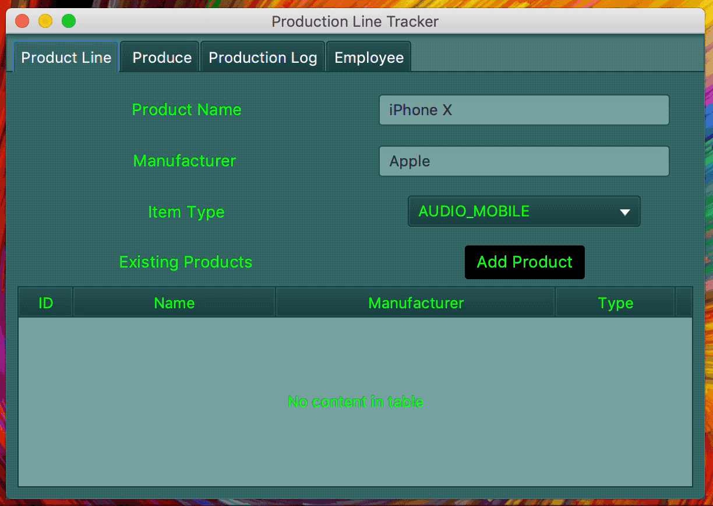
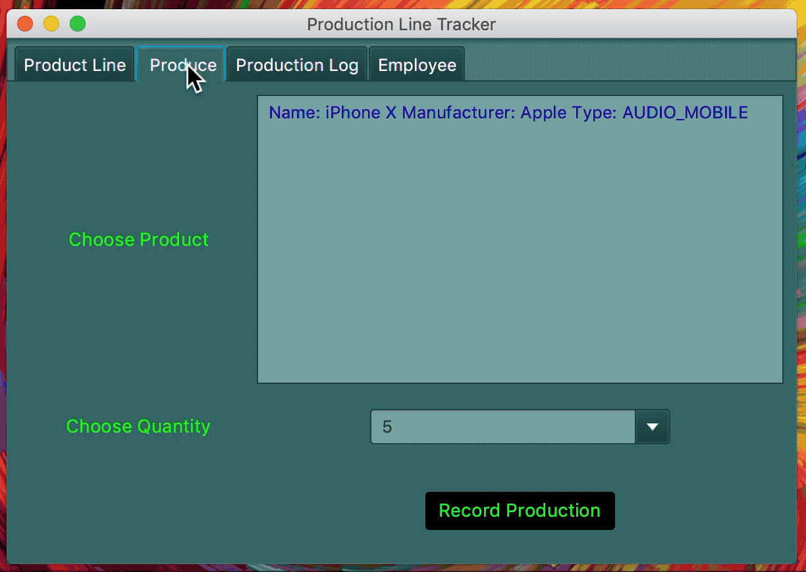
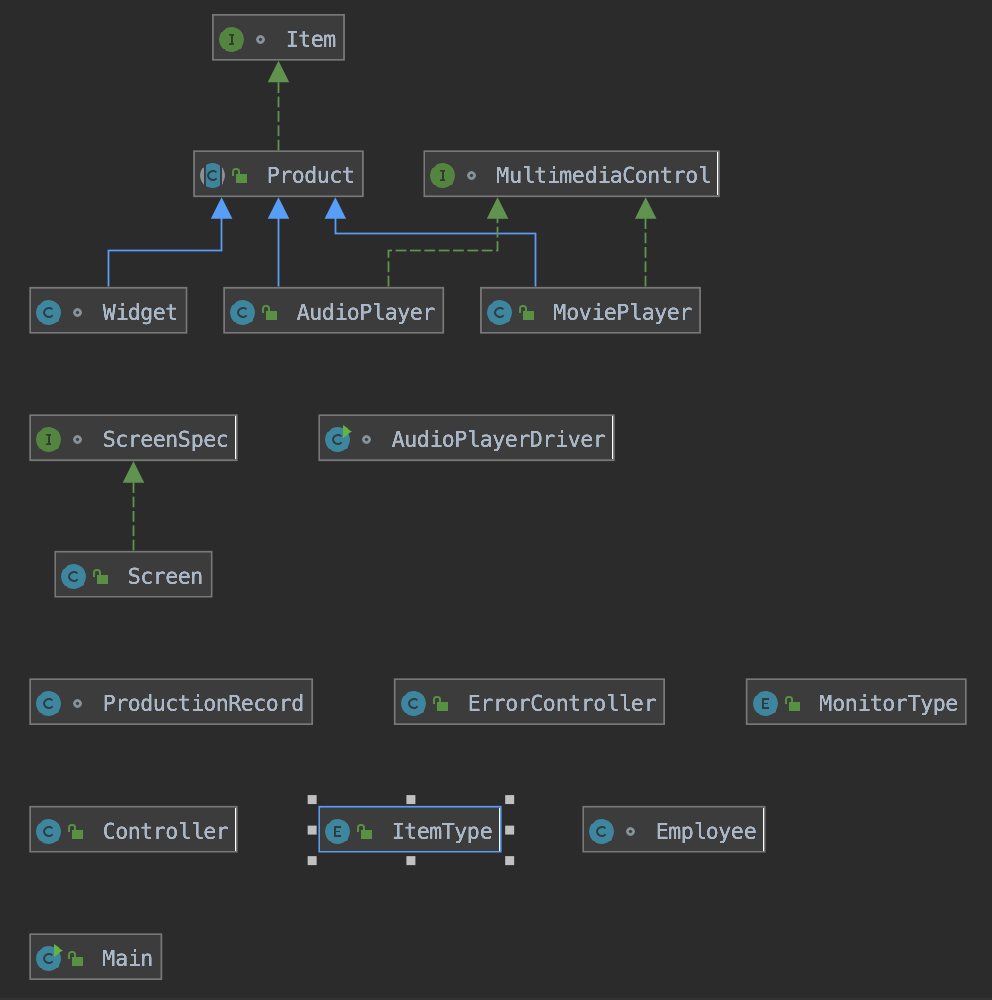

# Production Line Tracker
**Scenario**

You have been hired to create software for a media player production facility that will keep track of what products are produced. Without the software, workers on the production floor are physically producing items and having to write down what is produced in a production log book. Management would like the production tracking to be more automated so the workers don't need to spend as much time recording what was produced, the log will be more accurate, and it will be easier to generate production reports. In addition to the ability to record production, the software also needs the ability to add to the product line (the catalog of products that are able to be produced).
-   **Goals** (high level intended outcomes; for software, a Product Backlog)
    -  Allow a user to add new products that are able to be produced and store them in a collection.
    - The collection of products that can be produced can be displayed at any time.
    - Allow a user to track production of products, including specifying how many items of that product were created. The program will then create a record for each of these items and store them in a collection.
     - The collection of created items can be displayed at any time.
     - Production statistics can be displayed – Total items produced, number of each item type, the number of unique products created etc.
     -  Employee accounts can be made.
     - Allow easy modification to handle different products.
-   **Constraints** (externally imposed limitations on system requirements, design, or implementation or on the process used to develop or modify a system)
    -   The program will be a GUI database program written in Java.
    -   The program must be flexible to allow for future expansion.
    -   Code should be saved to a private GitHub repository.
    -   Follow best practices for style, documentation, and quality.
-   **Timelines** (a breakdown of the Product Backlog into time-bound smaller, more detailed tasks in Sprint Backlogs)
    -   Three 5-week sprints.

## Demonstration
Add Product to Tracker

Recording Production of Product

## Documentation

Create a docs folder in your project. If using Java, generate JavaDoc in your IDE. If using C++, use Doxygen. Change repository settings (using Settings at top of page) to use GitHub Pages with your docs folder. Add a link to the javadoc/doxygen index.html file with this markdown: \[Text to appear]\(URL)  
The URL will be YourGitHubUserName.github.io/YourRepositoryName/foldername/filename  
Do not include the docs folder name in your URL.  
Sample: \[JavaDoc]\(https://pv-cop.github.io/PV-README-TEMPLATE/javadoc/index.html)    
[JavaDoc](https://pv-cop.github.io/PV-README-TEMPLATE/javadoc/index.html)

## Diagrams

Class Diagram   
 
 
 ## Built With

* IntelliJ IDEA  
* SceneBuilder

## Contributing

Create table in database to store employee information inorder to keep track of which employee edited to logs.

 ## Author
Benjamin Deleuze
 
 ## License

MIT License

## Acknowledgments

* https://www.w3schools.com/sql/
* Nicholas Hansen helped with css

## Key Programming Concepts Utilized
* Inheritance - creating a subclass, of a base call, to have all of the attributes of the base class.
* Polymorphism - using inherentance to to create a object of a base class and subclass.
* Encapsulation - having private fields while using gets and setters to manitpuat those fields.
* Generics - used to provide meaningful type constraints to instantiated variables and objects.
* DataBase - a used H2 database for the program.
* Regular Expressions - used to search for pattern matching in strings.
* Enums - special data type that has predefined constants by the class.
* Interfaces - is a base class that sets a blue print that must be fufilled buy the subclass.
* Abstract Classes - is similar to a Interface but the bule print does not have to be completly fulfilled.
* Recursion - process of a function calling itself untill a base case is has been met.
